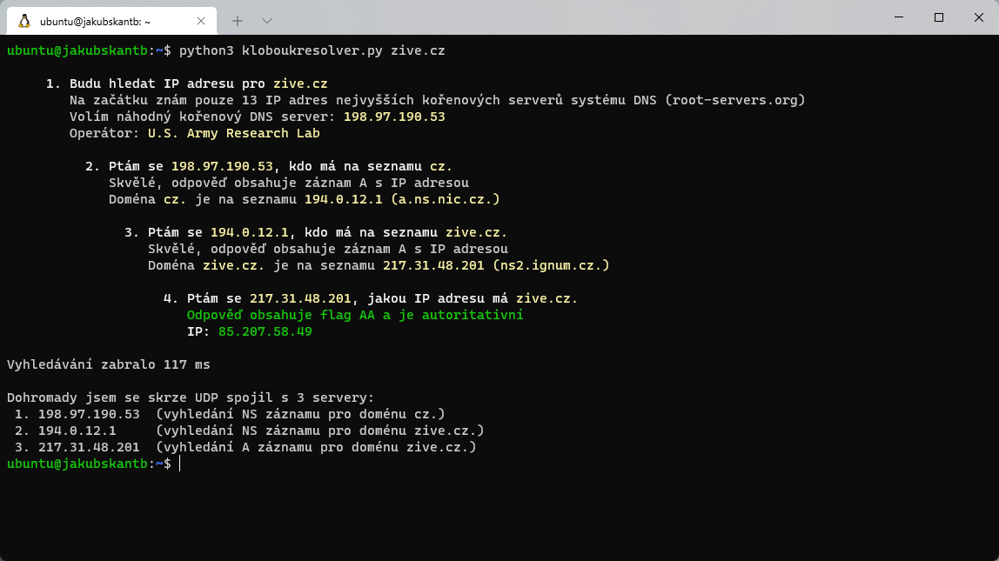
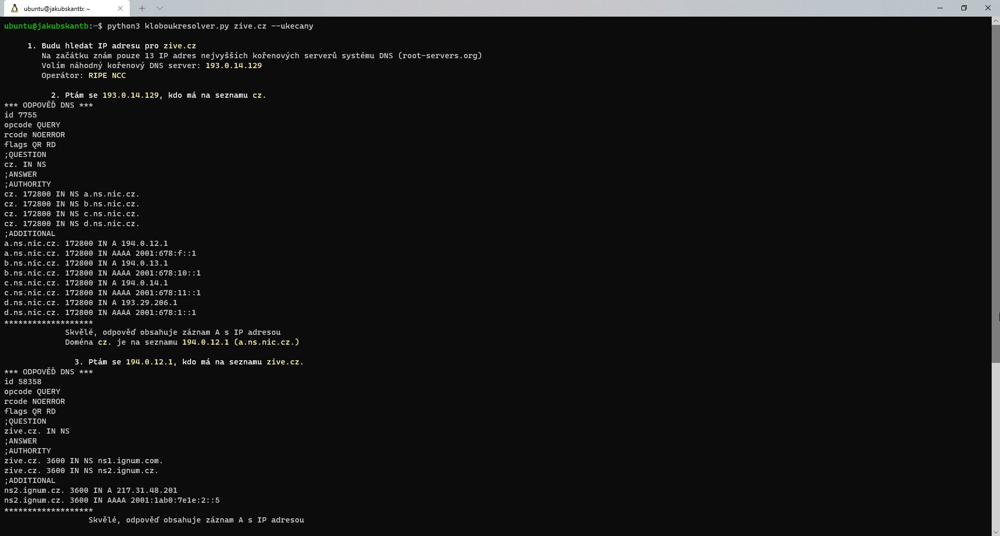

## Kloboukresolver
Demonstrace překladu doménového jména na IP adresu průchodem celého stromu od náhodného kořenového DNS serveru po poslední zónu
- **[Vyžaduje knihovnu dnspython](https://dnspython.readthedocs.io/en/latest/installation.html)**
- Je to naprostý bastl bez hlubší znalosti zmíněné knihovny!
- Nejsou ošetřeny všechny chyby, všechny situace!
- Všechny servery po cestě musejí odpovědět; není implementovaná volba alternativního NS, pokud ten první mlčí!
- Z toho plyne, že pokud to timeoutne/nenajde IP adresu, zkuste znovu

